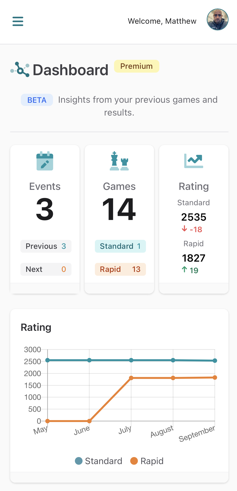
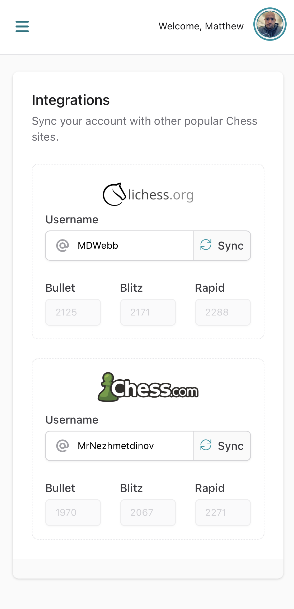
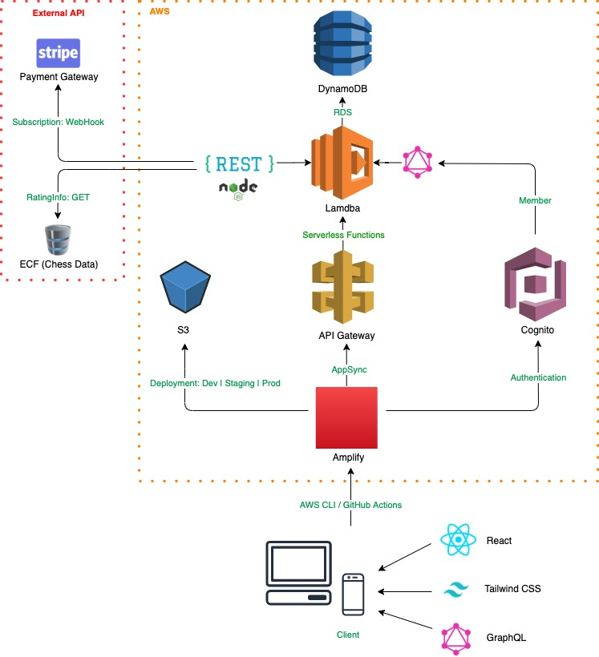
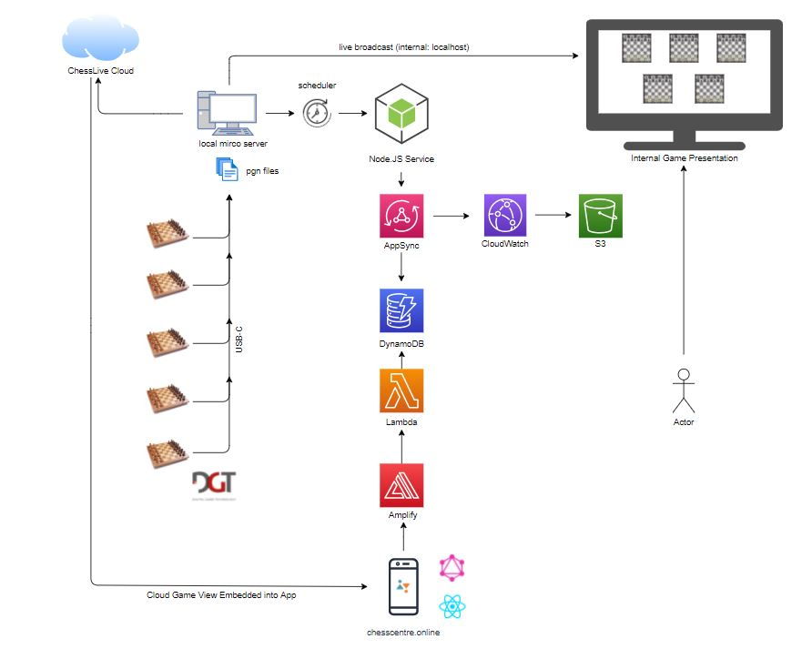
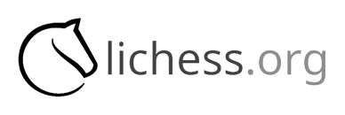

<p align="center">
  
  <h1 align="center"><strong></strong> The Chess Centre | Platform</h1>
</p>

<div align="center">

[](https://github.com/chess-centre/welcome)
[](https://www.codacy.com/gh/chess-centre/platform/dashboard?utm_source=github.com&amp;utm_medium=referral&amp;utm_content=chess-centre/platform&amp;utm_campaign=Badge_Grade&style=flat&colour=light)
[](https://github.com/chess-centre/platform/releases)
[](https://github.com/chess-centre/platform/issues?q=is%3Aissue+is%3Aclosed)
[](https://github.com/chess-centre/platform/issues)
  
</div>
  
This project contains the core source code of **The Chess Centre** application including its associated services and deployment configuration.

### Table of Contents
- [Motivation](#motivation)
- [Objective](#objective)
- [Examples](#examples)
- [Getting started](#getting-started)
  - [Prerequisites](#prerequisites)
  - [Environments](#environments)
- [Tech Overview](#tech-overview)
  - [Architecture](#architecture)
  - [Integrations](#integrations)
- [Contributing](#contributing)
- [Special thanks 👏](#special-thanks-)
- [License](#license)
- [Contributors ✨](#contributors-)

## Motivation

<span style="color:#5499ab; font-weight: bold;">The Chess Centre</span> was born through a love of Chess and built for the amazing community which surrounds it. Here we will provide keen chess players who enjoy playing over-the-board chess with a platform to utilise modern, accessible and easy to use features that enables them to easily find upcoming events, register and effortlessly track results of their games and those of others.

To support this goal a dedicated centre has been established for players to come, learn and play the game face to face. Seamlessly linking the physical face to face game at our fantastic venue with our digital platform, enabling new and existing players to participate and track their progress effortlessly.

- ♟️ website: [chesscentre.online](https:chesscentre.online)

Our mission is entirely <span style="color:#f0802b;">**#not-for-profit**</span> so we gladly welcome volunteers.
  
## Objective
  
Intentionally open and transparent and striving to make it easy to reproduce and contribute to our model, our long term goals include the following technical objectives:
  
- 💰 **Low cost**
    - Infrastructure
    - Support
- 🌻 **Scalable** 
    - White-label (independent deployments)
    - Internationalisation
- 🏗️ **Maintainable** 
    - Admin capabilities (non-technical users)
    - Documentation (technical / non-technical)
- 🚀 **Feature rich**
    - Embracing other chess projects / useful public APIs

## Examples

<p align="center">
  
  
</p>

## Getting started

### Prerequisites

- [Node.js](https://git-scm.com/downloads) - v14+
- [AWS Amplify CLI](https://docs.amplify.aws/cli/start/install) - v5.3.0

Clone the project:

```bash
$ git clone git@github.com:chess-centre/platform.git && cd platform
```

Change directory to the root of the React application:

```bash
$ cd chess-centre-app
```

Checkout our [develop](https://github.com/chess-centre/platform/tree/develop) branch - this is where PRs are merged pre-live

```bash
$ git fetch && git checkout develop
```

Install dependencies

```bash
$ yarn install
```

At this point you now have everything you need for the frontend UI, now you need the `AWS Amplify` backend.

- Our current practise is to manually set up your **AWS IAM** user (contact [@matt-d-webb](https://github.com/matt-d-webb) for this), providing you with the requisite configuration to pull the necessay backend environment(s). 

Example configuration:

```js
const config = {
  aws_project_region: "eu-west-1",
  aws_cognito_identity_pool_id: "eu-west-1:xxxxx-xxxx-xxxxx-xxxx-xxxx",
  aws_cognito_region: "eu-west-1",
  aws_user_pools_id: "eu-west-1_xxxxxxxx",
  aws_user_pools_web_client_id: "123xyz456ABC789dEFg",
};
```

Once you are setup with an IAM user, add your config in the app root named `aws-exports.js`

Then pull down the backend environment:

```bash
amplify env pull dev
```
  
You will now have a custom development environment! 🥳

Finally, start the project:

```bash
$ yarn start # default port 3000
```

### Environments
  
| Env  | Player API | Public API | Travel API 
| ------------- | ------------- | ------------- | ------------- |
| Develop  | mgsigrqo6  | bd7p7atax7 | qxbqiiv6nc |
| Staging  | 21bx1c1zlk  | vrhqu5b9u6  | qrqz8sdqtd |
| Production  | ms60qr0ljj  | zkxiggnvb5  | 1mif6e1fj6 |

## Tech Overview

The front-end app uses `create-react-app` and `tailwindcss`. The backend is entirely serverless using AWS (see Architecture).

- JavaScript
- React
- Tailwind CSS
- GraphQL
- Node

### Architecture

<details>
<summary>Overview</summary>
<br />
<p align="center">
  
</p>
</details>


<details>
<summary>Game Broadcasts</summary>
<br />
<p align="center">
  
</p>
</details>

### Integrations

<details>
<summary>Key Details</summary>
<br />
Taking advantage of the fantastic online chess sites, we pull in live data from the following sources:

<p align="left">
  
</p>

- Bullet Rating
- Blitz Rating
- Rapid Rating
- Profile Image
- Puzzle Rating
- Online Status

<p align="left">
  
</p>

- Bullet Rating
- Blitz Rating
- Rapid Rating
- Online Status 

<p align="left">
  
</p>

- Standard Rating
- Rapidplay Rating
- FIDE ID
- ECF Membership Status
- Recent Game History
- Latest Rating

<p align="left">
  
</p>

- Train departures
- Bus departures
  
</details>

## Contributing

See our [welcome](https://github.com/chess-centre/welcome) respository for guidelines on helping us develop this platform.

## Special thanks 👏

This project used many amazing open source libraries but for chess specifically, we are grateful for the efforts of:

- [PgnViewerJS](https://github.com/mliebelt/PgnViewerJS#readme)
- [chess.js](https://github.com/jhlywa/chess.js)
- [Chessground](https://github.com/ornicar/chessground)
- [pegjs](https://github.com/pegjs/pegjs)

## License

[](https://github.com/chess-centre/platform/LICENSE)

## Contributors ✨

Thanks goes to these wonderful people ([emoji key](https://allcontributors.org/docs/en/emoji-key)):

<!-- ALL-CONTRIBUTORS-LIST:START - Do not remove or modify this section -->
<!-- prettier-ignore-start -->
<!-- markdownlint-disable -->
<table>
  <tr>
    <td align="center"><a href="https://chesscentre.online"><br /><sub><b>Matt D. Webb</b></sub></a><br /><a href="https://github.com/chess-centre/platform/commits?author=matt-d-webb" title="Code">💻</a> <a href="https://github.com/chess-centre/platform/commits?author=matt-d-webb" title="Tests">⚠️</a> <a href="https://github.com/chess-centre/platform/commits?author=matt-d-webb" title="Documentation">📖</a> <a href="#business-matt-d-webb" title="Business development">💼</a></td>
    <td align="center"><a href="https://github.com/jbeasley123"><br /><sub><b>jbeasley123</b></sub></a><br /><a href="https://github.com/chess-centre/platform/commits?author=jbeasley123" title="Documentation">📖</a></td>
    <td align="center"><a href="https://github.com/AndyW359"><br /><sub><b>AndyW359</b></sub></a><br /><a href="#content-AndyW359" title="Content">🖋</a></td>
    <td align="center"><a href="https://github.com/CatVarley"><br /><sub><b>Cat Varley</b></sub></a><br /><a href="#ideas-CatVarley" title="Ideas, Planning, & Feedback">🤔</a></td>
    <td align="center"><a href="https://elmore.dev"><br /><sub><b>Adam Elmore</b></sub></a><br /><a href="https://github.com/chess-centre/platform/commits?author=adamelmore" title="Code">💻</a></td>
  </tr>
</table>

<!-- markdownlint-restore -->
<!-- prettier-ignore-end -->

<!-- ALL-CONTRIBUTORS-LIST:END -->
  
This project follows the [all-contributors](https://github.com/all-contributors/all-contributors) specification. Contributions of any kind welcome!
